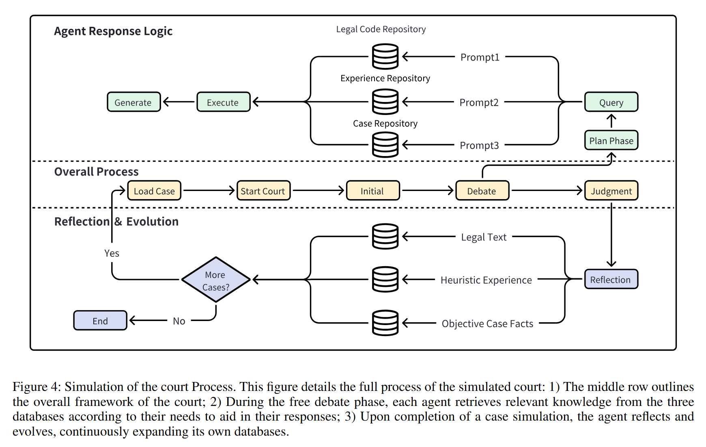

<h1 id="agentcourt" style="display: inline;">
  
  AgentCourt: Simulating Court with Adversarial Evolvable Lawyer Agents
</h1>

## Demonstration GIF


The above GIF demonstrates the adversarial evolution of lawyer agents in a simulated court setting.

---

## Paper
For an in-depth exploration of our research methodology and findings, please refer to our academic paper:
[AgentCourt: Simulating Court with Adversarial Evolvable Lawyer Agents](https://arxiv.org/abs/2408.08089)

## Video Demonstration
To watch a voice-over video demonstration of the system, visit the following link to our Bilibili video:
[View Video Demonstration on Bilibili](https://www.bilibili.com/video/BV1aXpUe3E6A?t=2323.7)
   
## Table of Contents

1. [Overview](#overview)
2. [Key Features](#key-features)
3. [Research Highlights](#research-highlights)
4. [Installation](#installation)
5. [Download Data](#download-data)
6. [Court Process](#court-process)
7. [Training](#training)
8. [Test](#test)
9. [Evaluation](#evaluation)
10. [Code Availability](#code-availability)
11. [Contributing](#contributing)
12. [Citation](#citation)
13. [Contact](#contact)

## Overview

AgentCourt is an innovative simulation system designed to replicate the entire courtroom process using autonomous agents driven by large language models (LLMs). This project aims to enable lawyer agents to learn and improve their legal skills through extensive courtroom process simulations.

## Key Features

- **Full Courtroom Simulation**: Includes judge, plaintiff's lawyer, defense lawyer, and other participants as autonomous agents.
- **Adversarial Evolutionary Approach**: Lawyer agents learn and evolve through simulated legal cases.
- **LLM-Driven Agents**: Utilizes advanced language models to power agent interactions and decision-making.
- **Continuous Learning**: Agents accumulate experience from simulated court cases based on real-world knowledge.

## Research Highlights

- Simulated 1000 adversarial legal cases (equivalent to a decade of real-world experience).
- Evolved lawyer agents showed consistent improvement in handling legal tasks.
- Professional lawyers evaluated the simulations, confirming advancements in:
  - Cognitive agility
  - Professional knowledge
  - Logical rigor

## Installation

To install the required dependencies, run the following command:

```bash
pip install -r requirements.txt
```

## Download Data

The dataset used in this project is available on Hugging Face:
[AgentCourt Dataset](https://huggingface.co/datasets/youzi517/AgentCourt)

## Court Process



The above image illustrates the detailed court process simulated in AgentCourt.

## Training

To train the model, follow these steps:

1. **Modify Configuration File**: Use a convenient large model interface to modify the `example_role_config.json` file. We used ERNIE-Speed-128K. If you do not have access to an API, you can use the local model specified in our configuration file and change `llm_type` to `offline`.

2. **Run the Simulation**: Execute the following command to simulate 1000 real cases:

    ```bash
    python main.py
    ```

## Test

To perform testing:

1. **Disable Reflection and Summary**: Turn off `reflect_and_summary()` in the code.

2. **Simulate Test Data**: Replace the plaintiff and defendant with the desired agents (evolved lawyers or base model) for comparison experiments.

3. **Obtain Test Results**: Run the simulation and collect the results.

## Evaluation

### 1. Human Evaluation

We invited a team of legal experts from China to evaluate the test cases.


### 2. Automatic Evaluation

You can refer to the following link for multiple tasks to evaluate the model:

[https://github.com/open-compass/LawBench/](https://github.com/open-compass/LawBench/)


The evaluation scripts are detailed in the provided link. Combine the evolved lawyers with appropriate prompts to maximize the utilization of the three databases and achieve good performance on the automatic evaluation tasks.

## Code Availability

**Note:** The code for this project is currently being organized and refined. We expect to upload it to this repository within the next week. Please check back soon for updates. We appreciate your patience and interest in our work.

## Contributing

We welcome contributions to the AgentCourt project. Please read our contributing guidelines before submitting pull requests.


## Citation

If you use AgentCourt in your research, please cite our paper:

```
@misc{chen2024agentcourtsimulatingcourtadversarial,
      title={AgentCourt: Simulating Court with Adversarial Evolvable Lawyer Agents}, 
      author={Guhong Chen and Liyang Fan and Zihan Gong and Nan Xie and Zixuan Li and Ziqiang Liu and Chengming Li and Qiang Qu and Shiwen Ni and Min Yang},
      year={2024},
      eprint={2408.08089},
      archivePrefix={arXiv},
      primaryClass={cs.CL},
      url={https://arxiv.org/abs/2408.08089}, 
}
```
## Acknowledgments

We would like to extend our gratitude to the team at Deli Legal for their innovative contributions to the field of AI-driven legal technology. Their intelligent legal system, available at [Deli Legal AI](https://www.delilegal.com/ai), has been a valuable reference and inspiration for our work on AgentCourt. For those interested in exploring more about Deli Legal's advancements, their detailed research paper can be found at [Deli Legal Research Paper](https://arxiv.org/abs/2408.00357).


The above image provides a glimpse into the Deli Legal system, showcasing its capabilities in enhancing legal processes through advanced AI technologies.

---

We are grateful for the support and insights provided by all contributors and partners, which have been instrumental in the development and success of the AgentCourt project.

## Contact

We are thrilled that you are interested in the AgentCourt project. If you find value in our work, please consider giving us a ⭐️ (Star) to show your support. Your encouragement is vital to our continuous improvement and expansion of this project.

Should you have any questions, suggestions, or wish to contribute code, feel free to reach out through the GitHub Issue system. We look forward to collaborating with you to push the boundaries of LLM-driven agent technology in legal scenarios.

Thank you for your attention and support!
